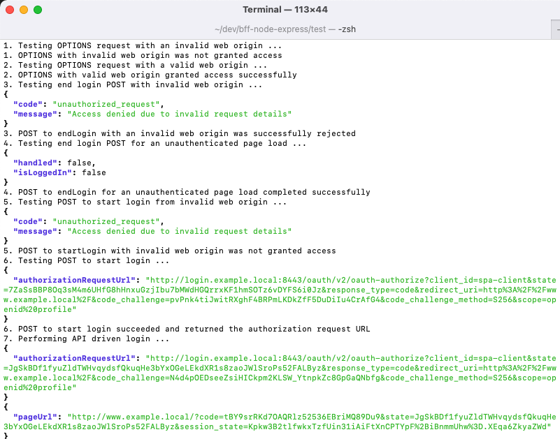

# How to Run the OAuth Agent Locally

Follow the below steps to get set up for developing and testing the OAuth Agent itself.

## Prerequisites

Ensure that these tools are installed locally:

- [Node.js 18+](https://nodejs.org/en/download/)
- [Docker Desktop](https://www.docker.com/products/docker-desktop)
- [jq](https://stedolan.github.io/jq/download/)

Also get a license file for the Curity Identity Server:

- Sign in to the [Curity Developer Portal](https://developer.curity.io/) with your Github account.
- You can get a [Free Community Edition License](https://curity.io/product/community/) if you are new to the Curity Identity Server.

## Update your Hosts File

Ensure that the hosts file contains the following development domain names:

```text
127.0.0.1  api.example.local login.example.local
:1 localhost
```

## Understand URLs

For local development of the OAuth Agent the following URLs are used, with HTTP to reduce development infrastructure:

| Component | Base URL | Usage |
| --------- | -------- | ----- |
| OAuth Agent | http://api.example.local:8080/oauth-agent | This acts as a Back End for Front End for SPAs |
| Curity Identity Server | http://login.example.local:8443 | This will receive a string client secret from the OAuth Agent |

## Build and Run the OAuth Agent

Run these commands from the root folder and the API will then listen on HTTP over port 8080:

```bash
npm install
npm start
```

Test that the API is contactable by running this command from the root folder:

```bash
curl -X POST http://api.example.local:8080/oauth-agent/login/start \
-H "origin: http://www.example.local" | jq
```

## Run Integration Tests

Run some tests that require only a running OAuth Agent, with a mocked Identity Server:

```bash
npm run wiremock
npm test
```

## Run End-to-End Tests

Run some tests that also use the Curity Identity Server.\
First copy a license file into the `test/end-to-end/idsvr` folder and then run the following command:

```bash
./test/end-to-end/idsvr/deploy.sh
```

Then run a test script that uses curl requests to verify the OAuth Agent's operations:

```bash
./test/end-to-end/test-oauth-agent.sh
```



## Free Docker Resources

When finished with your development session, free Docker resources like this:

```bash
./test/idsvr/teardown.sh
```